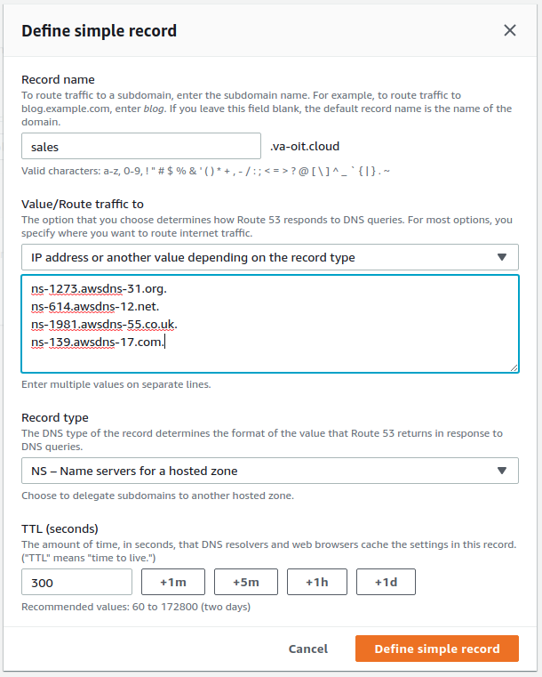
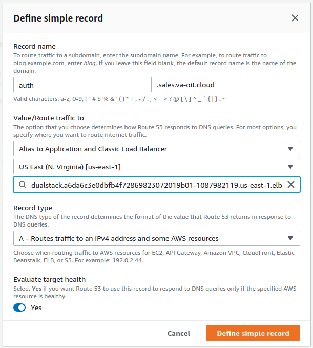
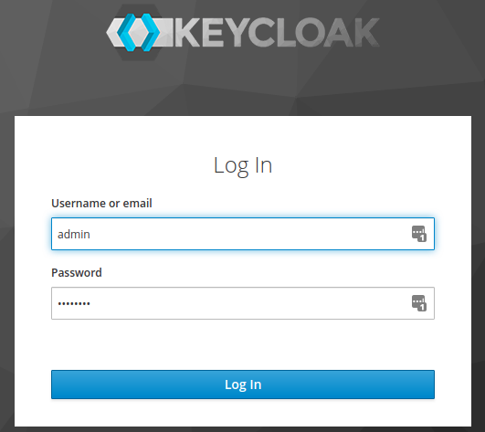
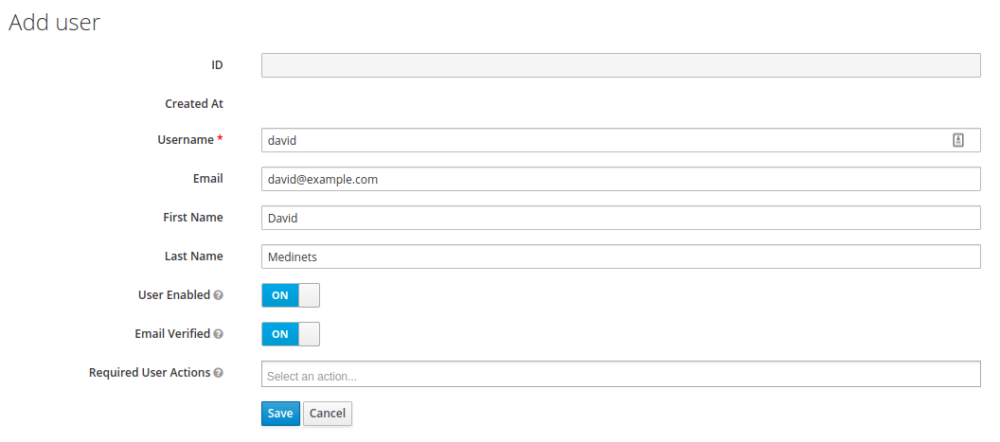

>**NOTE - Every works below except for getting Let's Encrypt to issue the SSL certificates. I'll update the procedure when that issue is resolved.**

This post shows how to add KeyCloak to an existing Kubernetes cluster to provide OIDC authentiation. This means that each Kubernetes user can use their own username and password to authenticate. In this post, RBAC will be
used for authorization.

If you need to know how to provision a Kubernetes cluster, see https://medined.github.io/centos/terraform/ansible/kubernetes/kubespray/provision-centos-kubernetes-cluster-on-aws/.

I make no claims that the process shown below is the best or is even appropriate for your situation. Please adapt it was needed.

KeyCloak will have an `admin` user that is wholy separate from the kubernetes cluster.

## Acknowledgements

This work is being done at the request of the Enterprise Container Working Group (ECWG) of the Office of Information and Technology (OIT - https://www.oit.va.gov/) at the Department of Veteran Affairs.

## The Goal

When you have finished going through these steps, you'll been able to switch between a `david` user with limited permissions and the `admin` user with all permissions.

You will have a `~/.kube/config` file that looks something like this:

```
apiVersion: v1
clusters:
- cluster:
    certificate-authority-data: LS0...LQo=
    server: https://kubernetes-elb-flooper-50468157.us-east-1.elb.amazonaws.com:6443
  name: cluster.local
contexts:
- context:
    cluster: cluster.local
    user: kubernetes-admin
  name: admin
- context:
    cluster: cluster.local
    namespace: sales
    user: david
  name: david
current-context: david
kind: Config
preferences: {}
users:
- name: kubernetes-admin
  user:
    client-certificate-data: LS0...LQo=
    client-key-data: LS0...tCg==
- name: david
  user:
    auth-provider:
      config:
        client-id: kubernetes-cluster
        client-secret: 68d1b483-48dc-4fc2-b07d-4c46c3396813
        id-token: eyJ...rrw
        idp-issuer-url: https://keycloak.david.va-oit.cloud/auth/realms/master
        refresh-token: eyJ...cEw
      name: oidc
```

This configuration allows you to run `kubectl` as either the `admin` user or the `david` user. Regular users of kubernetes will not have the `admin` information. The `david` user wil have restricted permissions.

## Install KeyCloak

**Note that this KeyCloak as no backup and uses ephemeral drives. Any users and groups will be lost if the pods is restarted. I think.**

**Once you have KeyCloak integrated into the cluster, you (as the admin) can use `--context='admin'` and `--context='david'` to select which user to authenticate as.**

* Connect to a directory.

```bash
cd /data/project/oidc
```

* Pick a namespace name. A `sales` namespace is used to represent a group inside your organization. Following these steps will allow every group to have their own OIDC server. If this is not right for you, adjust as needed.

```bash
export NAMESPACE="sales"
```

* Create a namespace.

```bash
kubectl apply -f - <<EOF
apiVersion: v1
kind: Namespace
metadata:
    name: $NAMESPACE
    labels:
        name: $NAMESPACE
EOF
```

* Create a password for the KeyCloak `admin` user. If you follow the process below, your KeyCloak will be on the internet so you need to keep this password secret. **Don't loose the password!**. I'll also point out that the password is available to anyone who can read the YAML of the deployment. So, this technique might not be secure enough for your needs. The commands below store an eight character password to a file in your home directory.

```bash
echo $(uuid | cut -b-8) >> $HOME/keycloak-admin-password.txt
KEYCLOAK_ADMIN_PASSWORD=$(cat $HOME/keycloak-admin-password.txt)
echo $KEYCLOAK_ADMIN_PASSWORD
```

* Create a deployment for KeyCloak. Check https://quay.io/repository/keycloak/keycloak?tab=tags to see what is the latest image version.

See https://stackoverflow.com/questions/61819264/how-to-deploy-keycloak-on-kubernetes-with-custom-configuration for ideas about specifying a REALM in the `env` section and using a volume mount.

```bash
kubectl -n sales delete deployment keycloak

kubectl apply -f - <<EOF
apiVersion: apps/v1
kind: Deployment
metadata:
  name: keycloak
  namespace: $NAMESPACE
  labels:
    app: keycloak
spec:
  replicas: 1
  selector:
    matchLabels:
      app: keycloak
  template:
    metadata:
      labels:
        app: keycloak
    spec:
      containers:
      - name: keycloak
        image: quay.io/keycloak/keycloak:11.0.1
        env:
        - name: KEYCLOAK_USER
          value: "admin"
        - name: KEYCLOAK_PASSWORD
          value: $KEYCLOAK_ADMIN_PASSWORD
        - name: PROXY_ADDRESS_FORWARDING
          value: "true"
        ports:
        - name: http
          containerPort: 8080
        - name: https
          containerPort: 8443
        readinessProbe:
          httpGet:
            path: /auth/realms/master
            port: 8080
        startupProbe:
          httpGet:
            path: /auth/realms/master
            port: 8080
          failureThreshold: 30
          periodSeconds: 10
EOF
```

* Create a service for KeyCloak. Check https://quay.io/repository/keycloak/keycloak?tab=tags to see what is the latest image version.

```
kubectl apply -f - <<EOF
apiVersion: v1
kind: Service
metadata:
  name: keycloak
  namespace: $NAMESPACE
  labels:
    app: keycloak
spec:
  type: LoadBalancer
  ports:
  - name: http
    port: 80
    targetPort: 8080
  - name: https
    port: 443
    targetPort: 8443
  selector:
    app: keycloak
EOF
```

* If you examine the pod, you can probably ignore any `Startup probe failed`
messages. It takes a minute or two for the process to initialize.

* Check the service is running. You should see the `keycloak` service in the list. The external IP should be look like
`a6dXXX3e0dbfb4f72869823072019b01-1087982119.us-east-1.elb.amazonaws.com`.

```bash
export KEYCLOAK_HOST=$(kubectl --namespace $NAMESPACE get service keycloak -o=jsonpath='{.status.loadBalancer.ingress[].hostname}')
echo $KEYCLOAK_HOST
```

* **Vanity URL** Create a vanity domain for KeyCloak. This domain needs to point to the load
balancer found in the previous step. I use Route 53 but you can use any DNS service. Please make sure that your can correctly resolve the domain using `dig`. Please ignore that I have using "david" instead of "sales" for my sub-domain. My DNS skills are not the best.

```bash
export KEYCLOAK_HOST="auth.david.va-oit.cloud"
```







* Curl should redirect to `/auth`.

```bash
curl http://$KEYCLOAK_HOST
```

* Trying to use `https` will completely fail because the SSL certificate can't
be verified.

```bash
curl https://$KEYCLOAK_HOST
```

* **Vanity URL** Create an ingress for the vanity domain. Note that I am using the production
cluster issuer because I have confidence it will work. If you are not
confident, use the staging cluster issuer.

```bash
kubectl apply -f - <<EOF
apiVersion: networking.k8s.io/v1beta1
kind: Ingress
metadata:
  name: keycloak-ingress
  namespace: $NAMESPACE
  annotations:
    kubernetes.io/ingress.class: nginx
    cert-manager.io/cluster-issuer: letsencrypt-production
    certmanager.k8s.io/acme-challenge-type: http01
spec:
  tls:
    - hosts:
      - $KEYCLOAK_HOST
      secretName: keycloak-tls
  rules:
  - host: $KEYCLOAK_HOST
    http:
      paths:
      - backend:
          serviceName: keycloak
          servicePort: 80
        path: "/"
EOF
```

* **Vanity URL** Review the certificate that cert-manager has created. You're looking for `The certificate has been successfully issued` in the message section. It may take a minute or two. If the certificate hasn't been issue after five minutes, go looking for problems. Start in the logs of the pods in the `nginx-ingress` namespace.

```bash
kubectl --namespace $NAMESPACE describe certificate keycloak-tls
```

* **Vanity URL** Review the secret that is being created by cert-manager.

```bash
kubectl --namespace $NAMESPACE describe secret keycloak-tls
```

* Display important URLs for KeyCloak

```bash
cat <<EOF
Keycloak:                 https://$KEYCLOAK_HOST
Keycloak Admin Console:   https://$KEYCLOAK_HOST/auth/admin
Keycloak Account Console: https://$KEYCLOAK_HOST/auth/realms/master/account
EOF
```

* Visit KeyCloak.

```bash
xdg-open https://$KEYCLOAK_HOST
```



* Don't create a new realm. Just use `master` unless you are experienced with Keycloak.

* Click `Clients` under the Configure heading. For the Root URL, use either the load balancer url as shown below or the vanity url.

  * Click 'Create'.
    * Client ID: kubernetes-cluster
    * Root URL: https://a6dXXX3e0dbfb4f72869823072019b01-1087982119.us-east-1.elb.amazonaws.com/
    * Click `Save`
    * **Is the '/' needed if the root url was specified above?**
    * Change the Access Type to `confidential`. This will ensure that client secrets are available on the `Credentials` tab. You'll need to use `/` (just the slash) as the Valid Redirect URIs value. Note the secret because it will be used later. I store it in `$HOME/keycloak-client-secret.txt`.

* Click `User` under the Manage heading.

  * Click `View all users`. Only the `admin` user should exist in new KeyCloak installations.

  * Click `Add user`. Keep the default except for the following. Change the values as needed.
    * username: david
    * email: david@example.com
    * first name: David
    * last name: Medinets
    * Click `Save`.



  * Click the `Credentials` tab. Enter a password. Then confirm it. Turn off `Temporary`. And finally click `Set Password`. Click the `Set password` button in the popup confirmation box.

* Create RBAC for the new user. Change "david" below to your new username. The role rules are here to provide a simple example. Update them to match your own requirements. Especially, the KeyCloak hostname.

**`kubectl` can be used without a context parameter because `~/.kube/config` has not yet been updated.**

```bash
export USERNAME="david"

kubectl apply -f - <<EOF
---
kind: Role
apiVersion: rbac.authorization.k8s.io/v1
metadata:
  name: $USERNAME-role
  namespace: $NAMESPACE
rules:
  - apiGroups: ['']
    resources: [pods]
    verbs:     [get, list, watch, create, update, patch, delete]
---
kind: RoleBinding
apiVersion: rbac.authorization.k8s.io/v1
metadata:
  name: $USERNAME-role-binding
  namespace: $NAMESPACE
roleRef:
  apiGroup: rbac.authorization.k8s.io
  kind: Role
  name: $USERNAME-role
subjects:
- kind: User
  name: https://keycloak.david.va-oit.cloud/auth/realms/master#$USERNAME
  namespace: $NAMESPACE
EOF
```

* Create a credential-setup script which adds a user configration to `~/.kube/config`. Adapt this script to your needs. Especially, the `IDP_ISSUER_URL`. This script is just an example.

**Add this script to cron in order to never worry about stale tokens! I use `*/30 * * * * /home/medined/medined-credentials-setup.sh`. If you want to get fancy, you can use $LOGNAME instead of hardcoding the user name.**

```bash
cat <<EOF > $HOME/$USERNAME-credential-setup.sh
#!/bin/bash

CLUSTER_NAME="cluster.local"
USERNAME="$USERNAME"
PASSWORD="$(cat $HOME/keycloak-$USERNAME-password.txt)"
NAMESPACE=$NAMESPACE
IDP_ISSUER_URL="https://$KEYCLOAK_HOST/auth/realms/master"
IDP_CLIENT_ID="kubernetes-cluster"
IDP_CLIENT_SECRET="$(cat $HOME/keycloak-client-secret.txt)"

INSECURE_CERTIFICATE_FLAG="-k"

echo "CLUSTER_NAME=$CLUSTER_NAME"
echo "USERNAME=$USERNAME"
echo "PASSWORD=$PASSWORD"
echo "NAMESPACE=$NAMESPACE"
echo "IDP_ISSUER_URL=$IDP_ISSUER_URL"
echo "IDP_CLIENT_ID=kubernetes-cluster"
echo "IDP_CLIENT_SECRET=$IDP_CLIENT_SECRET"

IDP_TOKEN=$(curl $INSECURE_CERTIFICATE_FLAG -X POST \
  $IDP_ISSUER_URL/protocol/openid-connect/token \
  -d grant_type=password \
  -d client_id=$IDP_CLIENT_ID \
  -d client_secret=$IDP_CLIENT_SECRET \
  -d username=$USERNAME \
  -d password=$PASSWORD \
  -d scope=openid \
  -d response_type=id_token \
  | jq -r '.id_token')

REFRESH_TOKEN=$(curl $INSECURE_CERTIFICATE_FLAG -X POST \
 $IDP_ISSUER_URL/protocol/openid-connect/token \
 -d grant_type=password \
 -d client_id=$IDP_CLIENT_ID \
 -d client_secret=$IDP_CLIENT_SECRET \
 -d username=$USERNAME \
 -d password=$PASSWORD \
 -d scope=openid \
 -d response_type=id_token \
 | jq -r '.refresh_token')

kubectl config set-credentials $USERNAME \
  --auth-provider=oidc \
  --auth-provider-arg=client-id=$IDP_CLIENT_ID \
  --auth-provider-arg=client-secret=$IDP_CLIENT_SECRET \
  --auth-provider-arg=idp-issuer-url=$IDP_ISSUER_URL \
  --auth-provider-arg=id-token=$IDP_TOKEN \
  --auth-provider-arg=refresh-token=$REFRESH_TOKEN

kubectl config set-context $USERNAME \
  --cluster=$CLUSTER_NAME \
  --user=$USERNAME \
  --namespace=$NAMESPACE
EOF

chmod +x $HOME/$USERNAME-credential-setup.sh
```

* Switch to the user-specific context.

```bash
kubectl config use-context $USERNAME
```

* Execute the new script.

```bash
./$USERNAME-credential-setup.sh
```

* Now you can use the context in your `kubectl` command like this:

```bash
kubectl --context=medined get pods
```
